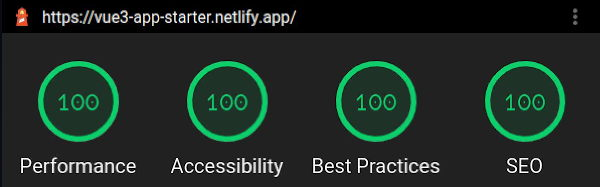

# vue3-typescript-app-starter

This is a starter setup for your next Vue3 / Typescript app.

It uses Vue3 beta, typescript and webpack and supports some neat features:

* router
* lightweight global state (not Vuex)
* typescript
* code splitting and tree shaking
* inserts base64 URLs for small assets (<=8kb)
* splits large scripts into chunks to be loaded in parallel
* prefetches async components (if browser supports prefetch hint)
* automatically generates favicons and app icons out of your logo
* SRI (adds integrity hashes to script tags, see [SRI on MDN](https://developer.mozilla.org/en-US/docs/Web/Security/Subresource_Integrity))

## Usage

To use it you may simply fork this repository or use a tool like [degit](https://github.com/Rich-Harris/degit), that downloads only the code without git history for you:

```sh
yarn global add degit # or npm install -g degit
cd /path/to/your/project
degit 'nkoehring/vue3-typescript-app-starter#main' # degit defaults to master
```

As soon as you have the code, you can go the "typical" path, assuming you're inside your new projects directory:

```sh
yarn # or npm install
yarn build # or npm run build # builds the application
yarn dev # or npm run dev # runs a live-reload dev server
```

You'll find the running application at [localhost:8080](http://localhost:8080) or subsequent ports in case something already runs on 8080.

## Performance



See for yourself [on lighthouse](https://googlechrome.github.io/lighthouse/viewer/?psiurl=https%3A%2F%2Fvue3-app-starter.netlify.app%2F&strategy=mobile&category=performance&category=accessibility&category=best-practices&category=seo)

## Contributing

This happened over night after setting up a new Vue3 application. It might have lots of strange quirks and misconfigurations.

Please help to make this starter setup even better by writing an issue or pull request.
